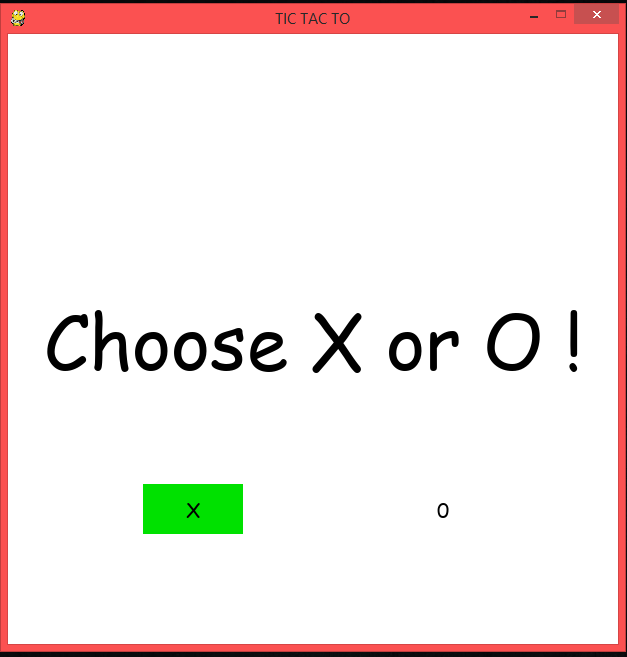
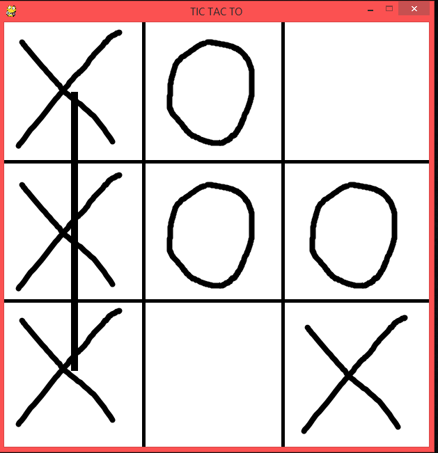
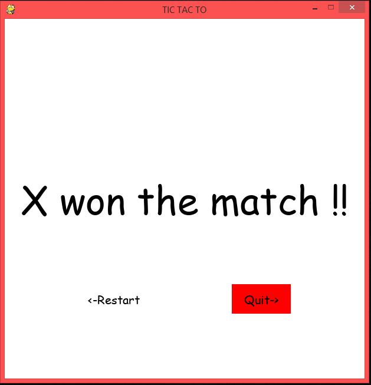

# TIC-TAC-TO

This is a TIC TAC TO game
playable on windows or mac or linux provided you have python and pygame installed on your computer, 
you can download a portable version of python and pygame in just one click - https://goo.gl/wvVkeC

INSTRUCTIONS:

     1. Select the symbol that you want [X or O]
     2. By default the player 2 will be assigned the opposite
     3. You can use the numpad on your keyboard to enter your choice
     4. the game will determine who is the winner and also if the match is a draw!
     5. In the end you have the option to play again or quit
    
This is part of my venture to understand python and programming in general 

I have published this as open to all so go ahead and modify and add any features if you want 
I would love to see what the world can do!!

